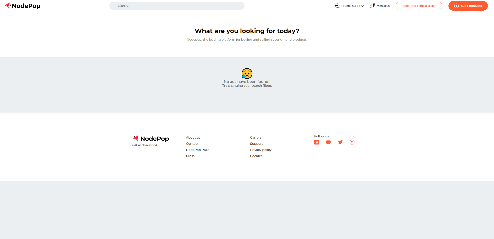

# Entrega de la práctica del módulo 10 Desarrollo backend avanzado con Nodejs

Además del contenido perteneciente a la práctica de introducción al desarrollo backend (módulo 4) este proyecto se complementa con las las tareas relacionadas a la práctica del módulo 10 de desarrollo backend avanzado.

En la carpeta documentation del propio proyecto se puede acceder al fichero pdf con el [enunciado completo de la práctica](./documentation/enunciado_modulo_10.pdf).

### Tareas añadidas

- Autenticación de rutas privadas del API con JWT.
- Internacionalización y control de idiomas en las vistas.
- Subida de imágenes al servidor con Multer.
- Creación de microservicio con Cote que en segundo plano se encargue de generar Thumbnail con Jimp/Sharp.
- Añadir testing con Supertest al API.
- Creación de un módulo público en npm.

## Modulo npm

El módulo npm publicado obtiene un nombre aleatorio de un personaje de Disney desde el API pública.
El módulo de npm se puede descargar desde https://www.npmjs.com/package/psdigital-random-character-name
Se puede descargar el repositorio desde: https://github.com/pablopsdigital/psdigital-npm-module

Para instalarlo se debe ejecutar el comando:

    npm i psdigital-random-character-name

# Enunciado práctica módulo 4

La documentación con el enunciado se puede consultar [aquí](documentation/enunciado.pdf)

# Proyecto Nodepop

## Arrancar el proyecto

Tras clonar el repositorio que se encuentra en Gitlab:

```sh


git clone https://gitlab.keepcoding.io/pablopsdigital/web11_modulo04_desarrollo_backend_con_nodejs_practica.git


```

se debe iniciar el proyecto con el comando

```sh


npm install


```

antes de utilizar la aplicación se recomienda cargar datos de ejemplo con los que poder trabajar con los endpoints del api, para ello usamos el comando.

```sh


npm run loadData


```

Los ficheros del script que se ejecuta se encuentran en el directorio **scripts**.

Finalmente se podar lanzar una ejecución del servidor en modo desarrollo con el comando

```sh


npm run dev


```

## Inicializar la base de datos

Para iniciar la base de datos mongoDB usamos el comando

```sh


npm run initDB


```

## Inicializar datos de ejemplo

Para cargar la base de datos con datos de ejemplo con los que poder trabajar usamos el comando. Los ficheros del script que se ejecuta se encuentran en el directorio scripts.

```sh


npm run loadData


```

## Documentación del API v1

Para obtener la información de los endpoinds disponibles en la versión v1 del api debemos cargar la ruta:

[http://localhost:300/api/api-docs](http://localhost:3000/api/api-docs/)

Dicha documentación está generada con Swagger, y se almacena un fichero de definición en el documento swagger.js en el directorio raíz del proyecto.

## Generación de plantillas

En cuanto a la gestión de plantillas y la página publica se ha duplicado el controlador general de filtrado de la consulta, en este caso se podría hacer un servicio que recogiera los parámetros y los enviara al controlador del api, de forma que no se repitiese código.

A continuación se muestran algunas imágenes del frontend y el uso de filtros a través de url como: http://localhost:3000/?skip=1&limit=4

En cuanto a las imágenes y estilos se ha optado por situarlos en la carpeta public, además de realizar includes para segmentar los diferentes componentes del frontend depositados en la carpeta views>includes




# Añadido práctica módulo 10

## Autenticación y obtención de un token

En el fichero de inicialización de datos para cargar inicialmente la base de datos, existe un usuario con el que poder obtener el **token** que permita realizar diferentes tareas.

    {
        "email": "user@example.com"
        "password": "1234"
    }

## Levantar el microservicio para generar miniaturas

Abrir una nueva terminal adicional a la terminal donde se ejecuta el API y desplazarse hasta el directorio del microservicio y posteriormente ejecutar nodemon

    cd microservices
    nodemon createThumbnail.js

o

    cd microservices
    npm run createThumbnail.js

## Fichero .env.example

En el proyecto se adjunta un fichero de ejemplo con las variables utilizadas. Para usarlo se debe renombrar el fichero como .env y sustituir cada unos de los ejemplos por los datos reales.

    MONGODB_URL=urlmongoconnection
    MONGODB_URL_TEST=urlmongoconnection
    JWT_SECRET=secretcode

**- MONGODB_URL**: Hace referencia a la cadena de conexión a la base de datos Mongo.
**- DB. MONGODB_URL_TEST**: Variable a la cadena de conexión a una base de datos para realizar los test.
**- JWT_SECRET:** Cadena de clave privada para generar el token jwt.

## Ejecución de test

Para ejecutar los test existe un script en el package.json

      "test": "cross-env NODE_ENV=test jest integration --verbose --silent",*

Para ejecutarlo

    npm run test
